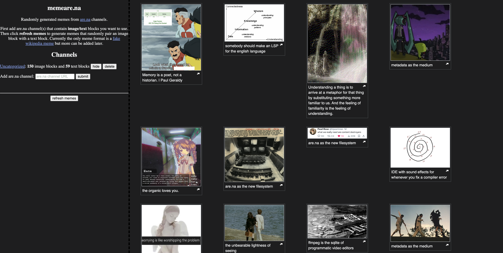

# memearena

Randomly generate memes based on image and text blocks in an [are.na](https://www.are.na/) channel.

Uses the [are.na API](https://dev.are.na/documentation/channels) to query for channel information

Link: <https://justinliang1020.github.io/memearena/>



## Developing

Install [pnpm](https://pnpm.io/). Then run the below commands to install and run the dev server.

```bash
pnpm i
```

```bash
pnpm dev
```

## Building

To create a production version of your app:

```bash
pnpm build
```
